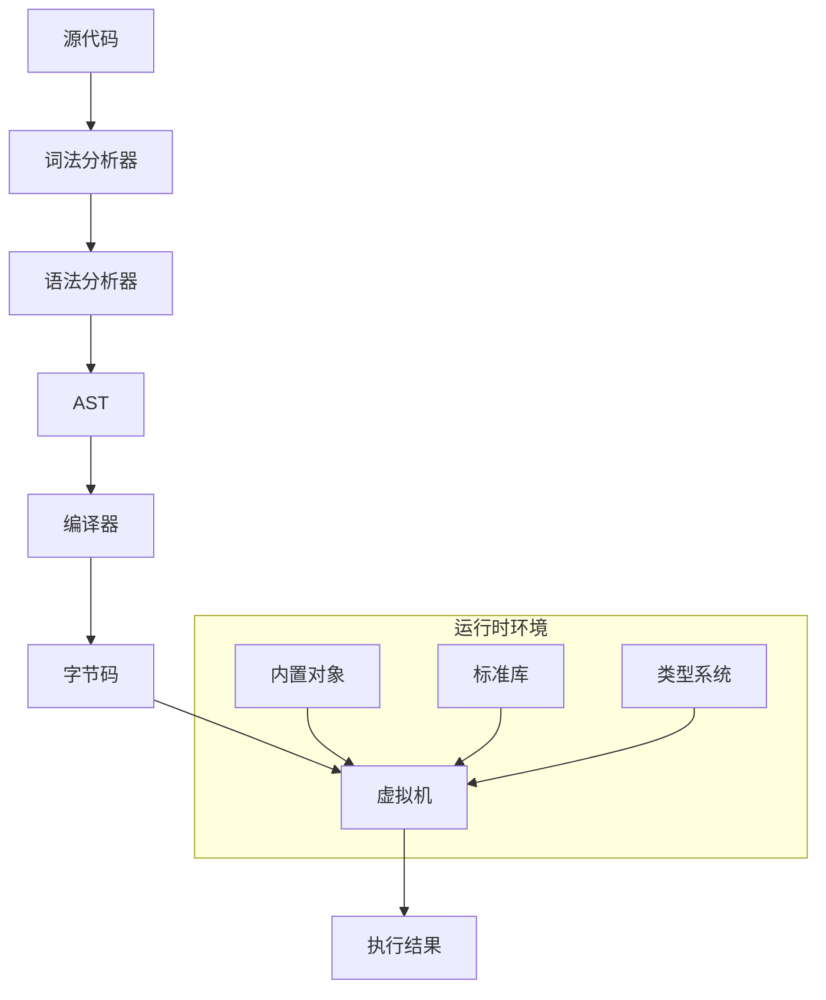

# Goja - Go语言实现的JavaScript引擎

Goja是一个用Go语言编写的JavaScript引擎,它实现了ECMAScript 5.1+规范。这是一个功能完整的JavaScript实现,可以嵌入到Go应用程序中执行JavaScript代码。

## 架构设计



### 核心组件

1. 词法分析器(Lexer)

- 位于 `parser/lexer.go`
- 将源代码转换为token流
- 支持完整的JavaScript词法规则
- 处理Unicode字符串

2. 语法分析器(Parser)

- 位于 `parser/`目录
- 将token流转换为抽象语法树(AST)
- 支持ECMAScript 5.1+语法
- 基于Otto项目改进

3. 编译器(Compiler)

- 位于 `compiler*.go`
- 将AST编译为字节码指令
- 实现变量作用域和闭包
- 支持常量折叠等优化
- 生成高效的字节码

4. 虚拟机(VM)

- 位于 `vm.go`
- 基于栈的虚拟机架构
- 实现完整的JavaScript运行时
- 支持:
  * 异常处理
  * 闭包
  * 原型继承
  * 垃圾回收

5. 内置对象

- 位于 `builtin_*.go`
- 完整实现ECMAScript标准库
- 主要对象实现:

  * Array - 完整实现数组操作(push/pop/slice等)
  * String - 字符串操作和Unicode支持
  * Number - 数值类型和运算
  * Object - 对象系统和原型继承
  * Function - 函数调用和闭包
  * RegExp - 正则表达式(有限支持)
  * Promise - 异步编程支持
  * Map/Set - 集合类型
  * TypedArrays - 类型化数组
  * Symbol - 符号类型
  * Error - 错误处理
  * JSON - JSON解析和序列化
  * Math - 数学函数库
  * Date - 日期时间处理
  * Global - 全局对象和函数
- 特点:

  * 符合ECMAScript规范
  * 高效的原生实现
  * 支持与Go函数互操作
  * 完整的类型转换
  * 异常处理机制
  * 原型继承系统

## 类型系统

Goja实现了完整的ECMAScript类型系统:

1. 基础类型

- Number (整数和浮点数)
  * 支持整数和IEEE 754浮点数
  * 特殊值处理(NaN, Infinity等)
  * 数值运算和类型转换
- String
  * Unicode字符串支持
  * 字符串操作和转换
- Boolean
  * true/false值
  * 类型转换规则
- Null & Undefined
  * 特殊值处理
  * 类型检查和转换
- Symbol
  * 唯一标识符
  * Well-known Symbols支持

2. 复杂类型

- Object
  * 属性描述符
  * 原型继承
  * 属性访问和修改
  * 对象生命周期
- Function
  * 函数调用
  * 闭包支持
  * this绑定
  * 构造函数
- Array
  * 索引访问
  * 长度管理
  * 数组方法
- 其他内置对象
  * Date
  * RegExp
  * Error
  * TypedArrays

3. 类型转换

- ToString
- ToNumber
- ToBoolean
- ToObject
- ToPrimitive
- 严格相等(===)和非严格相等(==)

4. 特点

- 符合ECMAScript规范
- 高效的类型检查
- 完整的类型转换
- 与Go类型的互操作
- 内存安全的实现

5. 实现细节

- 基于接口的类型系统
- 值类型和引用类型分离
- 高效的内存布局
- 类型转换优化
- 垃圾回收友好

## 运行时环境

### 概述

运行时环境是Goja引擎的核心组件,负责管理JavaScript代码的执行环境、内置对象、类型系统等。它提供了完整的ECMAScript规范实现,并支持与Go语言的无缝集成。

### 核心组件

1. 全局对象

- 完整实现ECMAScript标准内置对象(Object、Array、Function等)
- 支持所有ES6+新增对象(Promise、Map、Set等)
- 实现标准原型链和继承机制

2. 类型系统

- 支持所有JavaScript原生类型
- 实现ECMAScript规范的类型转换
- 高效的类型检查和运算

3. 函数系统

- 支持普通函数、构造函数、异步函数
- 实现闭包和作用域链
- 支持箭头函数和类

4. 异步编程

- Promise完整实现
- async/await支持
- 任务队列管理

5. 异常处理

- 标准的try-catch机制
- 详细的错误栈信息
- 支持自定义错误类型

6. Go语言集成

- 双向类型转换
- Go函数包装
- 反射优化

### 性能优化

1. 缓存机制

- 字段访问缓存
- 方法查找缓存
- 原型链缓存

2. 内存管理

- 对象池复用
- 垃圾回收优化
- 内存占用监控

3. 并发处理

- 协程安全
- 锁优化
- 任务调度

### 使用示例

```go
// 创建运行时实例
runtime := goja.New()

// 设置全局变量
runtime.Set("answer", 42)

// 运行JavaScript代码
val, err := runtime.RunString(`
    let x = 40;
    x + answer;
`)

// 获取结果
fmt.Println(val.Export()) // 输出: 82

// 异步编程示例
runtime.RunString(`
    async function test() {
        return await Promise.resolve(123);
    }
    test().then(console.log);
`)
```

### 最佳实践

1. 实例管理

- 合理复用Runtime实例
- 注意并发安全
- 及时释放资源

2. 错误处理

- 始终检查返回错误
- 使用try-catch捕获异常
- 保持错误栈信息

3. 性能优化

- 预编译重复使用的代码
- 使用对象池
- 避免频繁创建新实例

4. 内存管理

- 及时清理大对象
- 控制内存使用上限
- 监控内存泄漏

### 限制和注意事项

1. 并发限制

- Runtime实例非线程安全
- 需要额外同步机制
- 避免并发访问

2. 资源管理

- 注意内存使用
- 控制堆栈深度
- 避免死循环

3. 性能考虑

- 大量运算考虑性能
- 避免频繁类型转换
- 合理使用原生函数

## 特性

- 完整实现ECMAScript 5.1+规范
- 高性能字节码执行
- 支持闭包和作用域链
- 完整的异常处理
- 原生Go函数集成
- 支持模块化
- 内存安全

## 性能优化

1. 编译期优化

- 常量折叠
- 死代码消除
- 作用域分析

2. 运行时优化

- 快速属性访问
- 原型链缓存
- 内联缓存

## 局限性

1. 当前版本限制

- 不支持某些ES6+特性
- 正则表达式实现有限制
- 不支持JIT编译

2. 性能考虑

- 解释执行相比V8等JIT编译器较慢
- 内存占用可能较大

## 最佳实践

1. 性能优化

- 预编译JavaScript代码
- 重用Program对象
- 避免频繁创建VM实例

2. 内存管理

- 及时释放不用的VM实例
- 控制JavaScript堆大小
- 避免循环引用

## 新的实现方向

1. 功能增强

- 支持更多ES6+特性
- 实现JIT编译
- 改进正则表达式引擎

2. 性能优化

- 实现更多编译优化
- 改进垃圾回收
- 减少内存占用

3. 工具链

- 调试器支持
- 性能分析工具
- 更好的错误报告

## 使用示例

```go
package main

import (
    "fmt"
    "github.com/dop251/goja"
)

func main() {
    vm := goja.New()
  
    // 执行JavaScript代码
    v, err := vm.RunString(`
        var x = 40 + 2;
        x;
    `)
    if err != nil {
        panic(err)
    }
  
    fmt.Println(v.Export()) // 42
  
    // 注册Go函数
    vm.Set("add", func(call goja.FunctionCall) goja.Value {
        a := call.Argument(0).ToInteger()
        b := call.Argument(1).ToInteger()
        return vm.ToValue(a + b)
    })
  
    // 调用注册的函数
    v, _ = vm.RunString(`add(39, 3)`)
    fmt.Println(v.Export()) // 42
}
```

## 贡献指南

欢迎贡献代码和改进建议。请确保:

1. 提交前运行测试
2. 遵循Go代码规范
3. 更新相关文档
4. 添加必要的测试用例

## 许可证

请查看LICENSE文件了解详细的许可证信息。

## 编译器实现

### 架构设计

编译器是Goja引擎的核心组件之一,负责将JavaScript源代码转换为高效的字节码。其设计注重性能和代码质量。

### 主要组件

1. 程序表示(Program)

- 编译后的字节码存储
- 源码映射支持
- 运行时无关的设计

2. 变量管理

- var/let/const支持
- 变量提升实现
- TDZ(暂时性死区)检查
- 严格模式支持

3. 作用域系统

- 词法作用域
- 闭包支持
- 变量查找优化
- 作用域链管理

4. 代码块处理

- 循环块优化
- 异常处理块
- switch优化
- with语句支持

### 编译过程

1. 词法分析

- Token识别
- 关键字处理
- 注释处理
- 字符串模板支持

2. 语法分析

- AST构建
- 语法错误检查
- 表达式解析
- 语句解析

3. 语义分析

- 变量声明检查
- 类型推导
- 常量折叠
- 死代码消除

4. 代码生成

- 字节码生成
- 指令优化
- 跳转表生成
- 源码映射生成

### 优化策略

1. 静态优化

- 常量表达式计算
- 变量访问优化
- 指令合并
- 死代码消除

2. 内存优化

- 指令编码压缩
- 常量池优化
- 字符串驻留
- 内存对齐

3. 运行时优化

- 快速变量访问
- 高效作用域链
- 优化的指令集
- 缓存友好设计

### 调试支持

1. 源码映射

- 行号映射
- 列号映射
- 文件名映射
- 源码重建

2. 错误处理

- 详细错误信息
- 错误位置定位
- 调用栈生成
- 语法错误提示

### 扩展性

1. 语言特性支持

- ES6+特性
- 异步编程
- 类支持
- 模块系统

2. 工具集成

- 源码分析
- 代码格式化
- 语法高亮
- 代码补全

### 限制说明

1. 语言限制

- eval作用域限制
- with性能影响
- 动态特性限制

2. 性能限制

- 编译开销
- 内存使用
- 优化限制

3. 兼容性说明

- ES版本支持
- 特性支持度
- 非标准特性

## 虚拟机实现

### 架构设计

虚拟机是Goja引擎的执行核心,采用基于栈的设计,实现了高效的JavaScript代码执行。

### 核心组件

1. 栈系统

- 值栈(valueStack)
  * 操作数存储
  * 临时结果存储
  * 函数参数传递
- 调用栈(callStack)
  * 函数调用记录
  * 返回地址管理
  * 作用域链维护
- 特殊栈
  * 迭代器栈
  * 引用栈
  * 异常处理栈

2. 变量存储

- stash结构
  * 变量值存储
  * 名称映射表
  * 外部引用
  * 函数类型信息
- 作用域链
  * 变量查找
  * 闭包支持
  * 动态作用域

3. 执行上下文

- 程序状态
  * 程序计数器(PC)
  * 栈基址(SB)
  * 当前指令
- 运行环境
  * 参数信息
  * 返回值
  * this绑定
  * new.target

### 执行机制

1. 指令执行

- 指令解码
- 操作数处理
- 结果存储
- 流程控制

2. 函数调用

- 参数传递
- 环境准备
- 返回值处理
- 异常处理

3. 异常处理

- try-catch支持
- 异常栈构建
- finally块处理
- 错误传播

### 优化策略

1. 栈优化

- 栈帧复用
- 快速访问
- 内存对齐
- 动态扩展

2. 变量访问

- 直接寻址
- 缓存优化
- 引用优化
- 常量优化

3. 指令优化

- 指令流水线
- 分支预测
- 循环优化
- 内联缓存

### 内存管理

1. 栈内存

- 动态分配
- 自动回收
- 大小限制
- 溢出检测

2. 堆内存

- 对象分配
- 垃圾回收
- 内存压缩
- 内存限制

3. 资源控制

- 栈深度限制
- 内存使用限制
- 执行时间限制
- 资源释放

### 调试功能

1. 执行追踪

- 指令跟踪
- 栈追踪
- 变量监控
- 性能分析

2. 错误处理

- 异常定位
- 调用栈生成
- 变量状态
- 内存状态

### 安全特性

1. 执行隔离

- 沙箱环境
- 资源限制
- 访问控制
- 超时处理

2. 错误防护

- 栈溢出保护
- 类型检查
- 边界检查
- 异常恢复

### 性能特性

1. 执行效率

- 指令优化
- 缓存利用
- 分支预测
- 内存局部性

2. 内存效率

- 内存复用
- 紧凑存储
- 垃圾回收
- 内存池

3. 并发支持

- 协程安全
- 状态隔离
- 资源共享
- 同步机制

## 内置对象实现

### 整体架构

Goja实现了完整的ECMAScript标准内置对象系统,提供了丰富的JavaScript运行时环境。

### 对象体系

1. 基础对象

- Object
  * 原型继承
  * 属性描述符
  * 对象操作API
- Array
  * 动态长度
  * 稀疏数组
  * 高效存储
- Function
  * 函数调用
  * 构造函数
  * 原型方法

2. 包装对象

- String
  * 字符串操作
  * Unicode支持
  * 正则匹配
- Number
  * 数值计算
  * 精度控制
  * 类型转换
- Boolean
  * 布尔运算
  * 类型转换
  * 条件判断

3. 集合对象

- Map/WeakMap
  * 键值存储
  * 弱引用支持
  * 迭代接口
- Set/WeakSet
  * 唯一值集合
  * 弱引用支持
  * 集合操作

4. 特殊对象

- Promise
  * 异步编程
  * 链式调用
  * 错误处理
- Proxy
  * 对象代理
  * 行为拦截
  * 虚拟对象

### 实现特性

1. 属性系统

- 数据属性
  * 值存储
  * 可写性
  * 可枚举性
  * 可配置性
- 访问器属性
  * getter/setter
  * 属性拦截
  * 计算属性

2. 原型系统

- 原型链
  * 属性继承
  * 方法查找
  * 动态修改
- 构造函数
  * 实例创建
  * 原型绑定
  * new操作

3. 方法实现

- 标准方法
  * ES规范实现
  * 完整功能
  * 边界处理
- 优化方法
  * 快速路径
  * 内存优化
  * 性能提升

### 优化策略

1. 存储优化

- 内联缓存
  * 属性访问
  * 方法查找
  * 原型链
- 数据结构
  * 数组存储
  * 哈希表
  * 树形结构

2. 访问优化

- 快速路径
  * 常见操作
  * 热点方法
  * 特殊场景
- 缓存机制
  * 属性缓存
  * 方法缓存
  * 原型缓存

3. 内存优化

- 对象布局
  * 紧凑存储
  * 内存对齐
  * 字段复用
- 垃圾回收
  * 引用计数
  * 标记清除
  * 内存池

### 扩展性

1. 自定义对象

- 对象创建
  * 构造函数
  * 原型设置
  * 属性定义
- 行为定制
  * 方法重写
  * 属性拦截
  * 特殊操作

2. 原生集成

- Go互操作
  * 类型转换
  * 方法包装
  * 异常处理
- 性能优化
  * 直接访问
  * 内存共享
  * 并发处理

### 使用示例

```go
// 创建数组
array := runtime.NewArray()

// 添加元素
array.Push(1, 2, 3)

// 数组操作
array.Map(func(item Value) Value {
    return item.(int) * 2
})

// 创建对象
obj := runtime.NewObject()
obj.Set("name", "goja")
obj.Set("version", "1.0")

// Promise使用
promise := runtime.NewPromise()
promise.Then(func(value Value) Value {
    // 处理结果
    return nil
})
```

### 最佳实践

1. 对象使用

- 合理继承
- 属性管理
- 方法复用

2. 性能优化

- 缓存利用
- 快速路径
- 内存控制

3. 错误处理

- 类型检查
- 异常捕获
- 边界处理

## 类型系统实现

### 整体架构

Goja实现了完整的ECMAScript类型系统,提供了类型安全和高效的值操作。

### 类型体系

1. 基本类型

- Number
  * 整数(valueInt)
  * 浮点数(valueFloat)
  * 特殊值(NaN,Infinity)
- String
  * ASCII优化
  * Unicode支持
  * 字符串池
- Boolean
  * true/false
  * 类型转换
  * 条件运算
- Null/Undefined
  * 特殊语义
  * 类型检查
  * 默认值

2. 引用类型

- Object
  * 属性管理
  * 原型继承
  * 方法调用
- Function
  * 函数调用
  * 构造器
  * 闭包
- Array
  * 索引访问
  * 长度管理
  * 迭代器

3. 特殊类型

- Symbol
  * 唯一标识
  * 内置Symbol
  * 属性键
- BigInt
  * 大数运算
  * 精确计算
  * 类型转换

### 类型转换

1. 显式转换

- ToNumber
  * 数值解析
  * NaN处理
  * 进制转换
- ToString
  * 字符串化
  * 格式控制
  * 编码处理
- ToBoolean
  * 真值判断
  * 假值定义
  * 条件转换
- ToObject
  * 对象包装
  * 原型绑定
  * 属性继承

2. 隐式转换

- 运算符
  * 加法(+)
  * 相等(==)
  * 比较(<,>)
- 类型推导
  * 上下文判断
  * 类型优先级
  * 默认行为
- 强制转换
  * 类型检查
  * 错误处理
  * 边界情况

### 类型操作

1. 相等性判断

- 严格相等(===)
  * 类型相同
  * 值相等
  * 引用相等
- 宽松相等(==)
  * 类型转换
  * 值比较
  * 特殊规则

2. 类型检查

- instanceof
  * 原型链检查
  * 构造函数
  * 继承关系
- typeof
  * 类型判断
  * 特殊处理
  * 安全访问

3. 值操作

- 复制
  * 浅拷贝
  * 深拷贝
  * 引用处理
- 比较
  * 值比较
  * 引用比较
  * 排序支持

### 优化策略

1. 内存优化

- 值缓存
  * 小整数缓存
  * 字符串池
  * 常量复用
- 内存布局
  * 对齐优化
  * 字段压缩
  * 指针优化

2. 性能优化

- 快速路径
  * 类型判断
  * 值访问
  * 转换优化
- 计算优化
  * 整数运算
  * 浮点优化
  * 字符串操作

3. 特殊处理

- NaN处理
  * 比较规则
  * 运算结果
  * 类型转换
- 零值处理
  * 正零/负零
  * 除零处理
  * 比较规则

### Go互操作

1. 类型映射

- 基本类型
  * 数值映射
  * 字符串转换
  * 布尔值
- 复合类型
  * 数组/切片
  * Map/结构体
  * 接口

2. 值转换

- Go到JS
  * 类型适配
  * 值包装
  * 引用处理
- JS到Go
  * 类型断言
  * 值提取
  * 错误处理

### 使用示例

```go
// 类型转换
str := runtime.ToValue("123")
num := str.ToNumber()
bool := num.ToBoolean()

// 值比较
v1 := runtime.ToValue(42)
v2 := runtime.ToValue("42")
equals := v1.Equals(v2)      // true
strict := v1.StrictEquals(v2) // false

// Go类型转换
type Person struct {
    Name string
    Age  int
}
p := Person{Name: "John", Age: 30}
jsValue := runtime.ToValue(p)
```

### 最佳实践

1. 类型安全

- 严格检查
- 显式转换
- 错误处理

2. 性能优化

- 类型缓存
- 快速路径
- 内存复用

3. 互操作性

- 类型映射
- 值转换
- 错误处理

## 解析器实现

### 整体架构

解析器是Goja引擎的前端组件,负责将JavaScript源代码转换为抽象语法树(AST)。

### 核心组件

1. 词法分析器

- 字符处理
  * UTF-8解码
  * 字符分类
  * 位置跟踪
- Token识别
  * 关键字
  * 标识符
  * 运算符
  * 分隔符
- 字面量解析
  * 数值
  * 字符串
  * 正则表达式

2. 语法分析器

- 语法规则
  * 表达式
  * 语句
  * 声明
  * 模块
- 作用域管理
  * 作用域链
  * 变量声明
  * 闭包分析
- 错误处理
  * 语法错误
  * 错误恢复
  * 错误报告

3. AST构建

- 节点类型
  * 表达式节点
  * 语句节点
  * 声明节点
  * 程序节点
- 节点属性
  * 位置信息
  * 类型信息
  * 子节点
- 节点关系
  * 父子关系
  * 兄弟关系
  * 引用关系

### 解析过程

1. 源码处理

- 输入处理
  * 文件读取
  * 字符串处理
  * 编码转换
- 位置跟踪
  * 行号
  * 列号
  * 偏移量
- 注释处理
  * 单行注释
  * 多行注释
  * 文档注释

2. 词法分析

- 字符扫描
  * 字符分类
  * 字符组合
  * 转义序列
- Token生成
  * Token类型
  * 字面值
  * 位置信息
- 预处理
  * 空白处理
  * 行终止符
  * 分号插入

3. 语法分析

- 递归下降
  * 表达式解析
  * 语句解析
  * 声明解析
- 优先级处理
  * 运算符优先级
  * 结合性
  * 括号处理
- 上下文相关
  * 严格模式
  * 模块模式
  * 类字段

### 错误处理

1. 错误类型

- 语法错误
  * 非法Token
  * 意外终止
  * 不匹配
- 语义错误
  * 重复声明
  * 非法引用
  * 类型错误
- 词法错误
  * 非法字符
  * 未终止字符串
  * 非法转义

2. 错误恢复

- 同步点
  * 语句边界
  * 块边界
  * 分号
- 恢复策略
  * 跳过Token
  * 插入Token
  * 状态重置
- 错误报告
  * 位置信息
  * 错误消息
  * 上下文

### 源码映射

1. 映射生成

- 位置映射
  * 源码位置
  * 生成位置
  * 名称映射
- 映射格式
  * Base64 VLQ
  * JSON结构
  * 行列映射

2. 映射使用

- 调试支持
  * 源码定位
  * 断点设置
  * 变量检查
- 错误报告
  * 堆栈跟踪
  * 源码片段
  * 行号映射

### 优化策略

1. 性能优化

- 扫描优化
  * 字符缓存
  * 快速路径
  * 表驱动
- 内存优化
  * 对象池
  * 字符串驻留
  * 节点复用
- 算法优化
  * 预测分析
  * 缓存结果
  * 懒加载

2. 功能优化

- 错误处理
  * 精确定位
  * 快速恢复
  * 友好提示
- 源码映射
  * 增量更新
  * 压缩存储
  * 快速查找

### 使用示例

```go
// 解析源码
program, err := parser.ParseFile(nil, "test.js", `
    function add(a, b) {
        return a + b;
    }
`, 0)

// 访问AST
for _, stmt := range program.Body {
    switch s := stmt.(type) {
    case *ast.FunctionDeclaration:
        fmt.Printf("Function: %s\n", s.Name.Name)
    }
}
```

### 最佳实践

1. 错误处理

- 完整检查
- 友好提示
- 错误恢复

2. 性能优化

- 内存管理
- 算法选择
- 缓存使用

3. 可维护性

- 清晰结构
- 完整注释
- 测试覆盖

```

```
